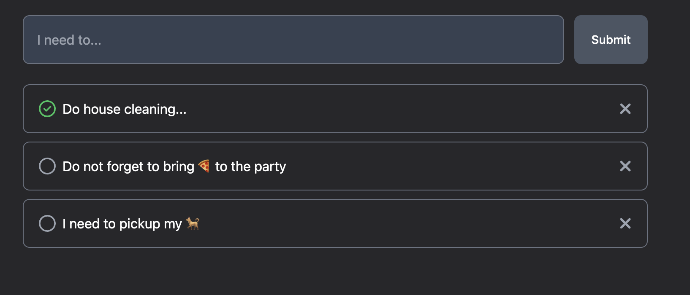

# Educational repo implementing tests for different FE libs

> - **This is 2. part** of the educational materials for testing FE
    libraries
> - [1. part with simpler unit tests is here](https://github.com/Vondry/JS-unit-test-examples)

In this project you will find implemented `TODO application` in **3 different FE libraries**:

- &nbsp;&nbsp;&nbsp;[React](https://react.dev) -
  implemented in [./packages/react](./packages/react)
- &nbsp;&nbsp;&nbsp;[Vue](https://vuejs.org) -
  implemented in [./packages/vue](./packages/vue)
- &nbsp;
  &nbsp;[Svelte](https://svelte.dev) - implemented in [./packages/svelte](./packages/svelte)

and also **backend** in 
&nbsp;&nbsp;[NestJS](https://nestjs.com/) that resides in [./packages/be](./packages/be).

There is also some shared code located inside [./packages/shared-code](./packages/shared-code) that
all packages above are using.

## Features

All code is written using [TypeScript](https://www.typescriptlang.org) and manages
using [npm workspaces](https://docs.npmjs.com/cli/v10/using-npm/workspaces).

- All apps have configured ESLint, Prettier and tests (main focus is on FE apps)
- [Git Hooks](https://git-scm.com/book/en/v2/Customizing-Git-Git-Hooks) features
  using [Husky](https://github.com/typicode/husky)
- There are also configured some [GitHub workflows](.github/workflows)

### Features of all 3 frontend apps

- User can `add`/`complete`/`delete` TODO
- Apps use [TanStack Query](https://tanstack.com) for data `fetching`/`mutation`
- Apps have `light`/`dark` mode using [Tailwind](https://tailwindcss.com)
- Apps are managed using [Vite](https://vitejs.dev)
    - App were created based
      on [Vite templates](https://vitejs.dev/guide/#scaffolding-your-first-vite-project): `npm create vite@latest <app-name> --template {react|vue|svelte}-ts`

### Features of the backend app

- There is an API for CRUD operations for TODOs
- TODOs are store inside [PostgreSQL](https://www.postgresql.org/) and data are managed
  using [TypeORM](https://typeorm.io)
    - There can be easily generated migrations based on changes to `entities schema` using `npm commands`
- API endpoints are validated using DTOs classes with [class-validators](https://github.com/typestack/class-validator)
  and [class-transformers](https://github.com/typestack/class-transformer)
- ENVs are type safe and validated using [Zod](https://zod.dev)

## Running apps

1. First run `npm install` in the root (no need to run install in packages)
    - Note that BE app require more configuration, see [README for BE](./packages/be/README.md)
2. Then run `npm run dev` in the BE application and at least one of the FE app

-------------

## 🏆 Challenge

Read [assignment description](./assignment/README.md) and improve your coding and testing skills!  
