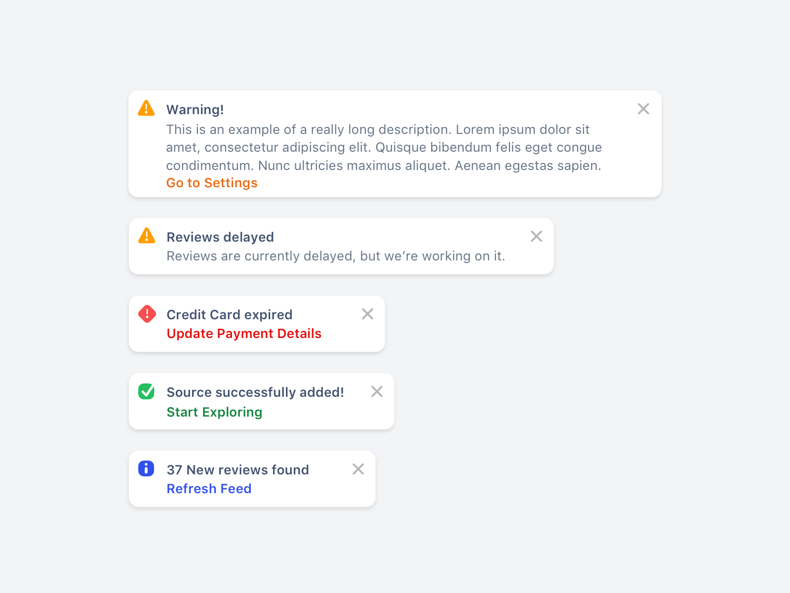

# Create toast notification component

## 👷 Setup new project

1. Choose your favorite FE
   library ([React](https://react.dev), [Vue](https://vuejs.org), [Svelte](https://svelte.dev), ...)
2. Use [Vite](https://vitejs.dev) to [bootstrap the project](https://vitejs.dev/guide)
3. Check that project is running (`npm run dev`)

-----

4. Use [Tailwind css](https://tailwindcss.com/) for styling
   purposes [guide here](https://tailwindcss.com/docs/guides/vite#vue)
5. Added support for tests with [Vitest](https://vitest.dev)

> Additional setup (might be done later): Git repo, Git Hooks (via [Husky](https://github.com/typicode/husky)), CI/CD (
> GitHub workflows)

## 🤔 Design thinking

Before writing any actual code, let's stop for a bit and think about the component API.

1. What is the component name?
2. What are the combinations of component usage?
3. What props will the component require?
4. Will you need any other helper components to encapsulate shared logic (eg. layout)?

Think about the points above and iterate over them to come up with the best approach 💪

## 🤓 Implementation

After you have some design on paper (in mind), let's go into coding

1. Create the component(s)
    - make sure to also implement [dark mode using Tailwind](https://tailwindcss.com/docs/dark-mode) 😎
2. Display all the combinations of the component (preferably as they are shown
   on [the image](./toast-notifications-design.png))
3. Write tests for the component(s)

-------------

### Kudos

[Toast notifications](https://dribbble.com/shots/14678733-Toast-Notifications-Concepts) were designed
by: [Corey Ginnivan](https://dribbble.com/CoreyGinnivan)
